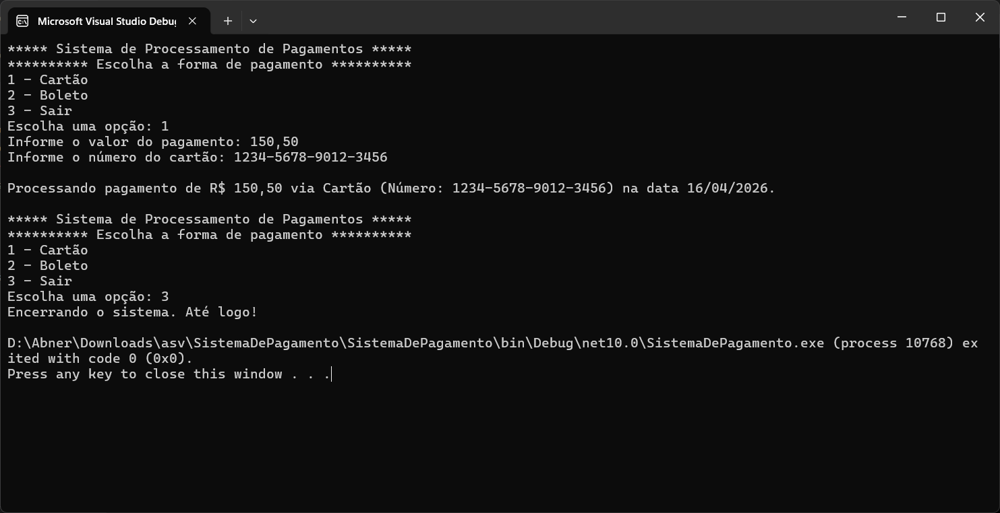
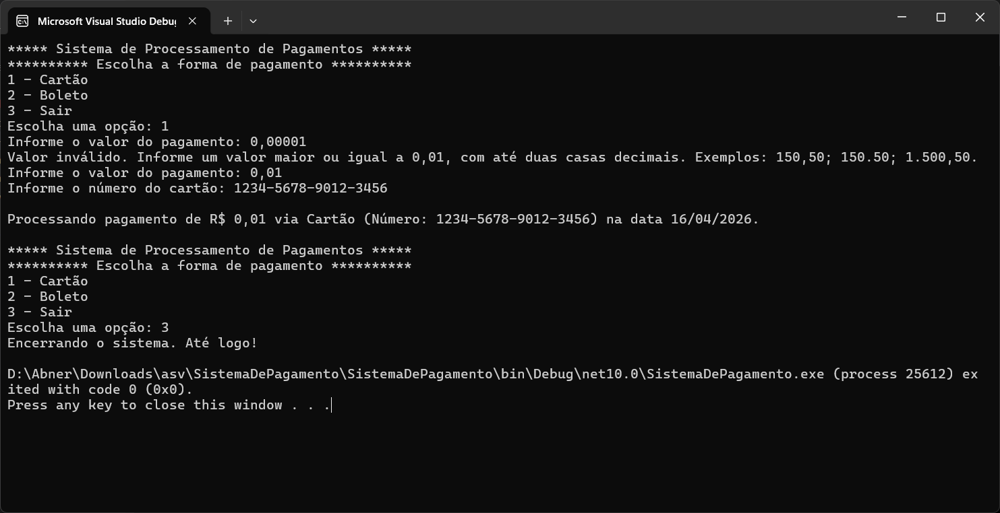
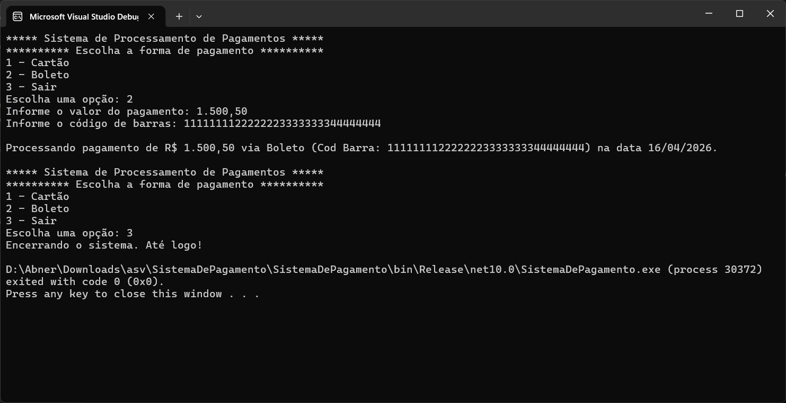
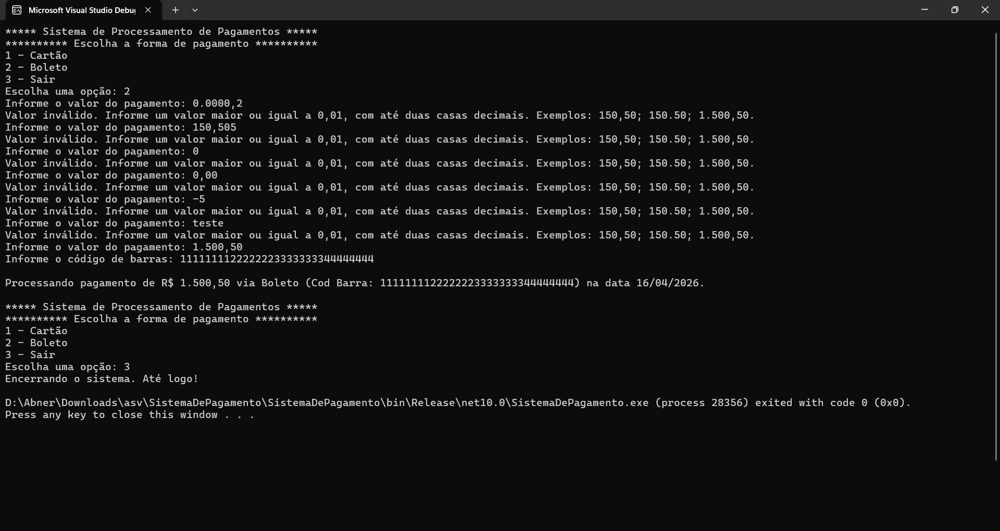
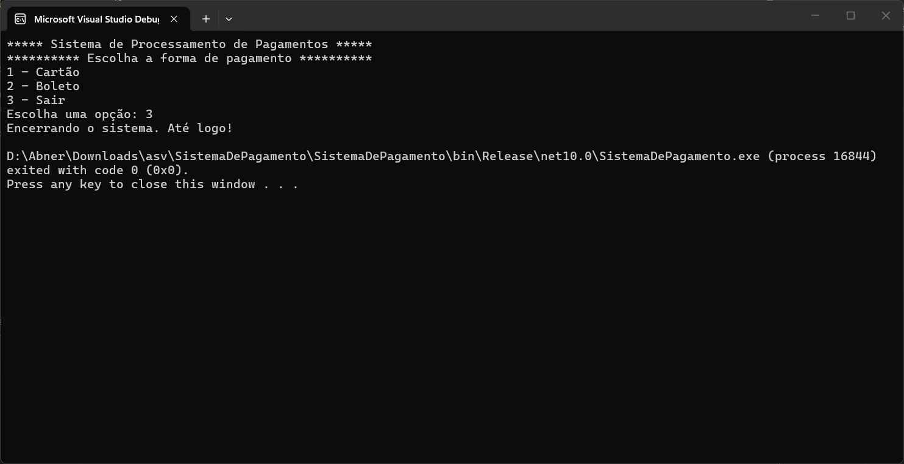

# Sistema de Pagamento

Aplicação console em C# desenvolvida para simular o processamento de pagamentos com Cartão e Boleto.

## Integrantes

Abner    - rm558468

Heloísa  - rm554535

Fernando - rm555201

Thomas   - rm554812

Eduardo  - rm556803


## Objetivo do Projeto

Permitir que o usuário escolha uma forma de pagamento, informe o valor e os dados específicos da operação, e visualize um resumo do processamento diretamente no console.

## Tecnologias Utilizadas

- C#
- .NET
- Aplicação Console

## Estrutura do Projeto

- `SistemaDePagamento/Program.cs`: fluxo principal da aplicação
- `SistemaDePagamento/Models`: classes de domínio orientadas a objetos
- `SistemaDePagamento/Utils`: menu estático e leitura/validação dos dados

## Funcionalidades

- Menu principal com exibição obrigatória via `Menu.ExibirMenu()`
- Processamento de pagamento com Cartão
- Processamento de pagamento com Boleto
- Validação de entrada para valores monetários com vírgula ou ponto
- Exibição de resumo com valor formatado em `pt-BR` e data no formato `dd/MM/yyyy`

## Como Executar

1. Acesse a pasta raiz do projeto.
2. Execute o comando:

```bash
dotnet run --project .\SistemaDePagamento\SistemaDePagamento.csproj
```

3. Escolha a opção desejada no menu.

## Exemplos de Uso

- Cartão:
  - `Processando pagamento de R$ 150,50 via Cartão (Número: 1234-5678-9012-3456) na data 01/01/2025.`
- Boleto:
  - `Processando pagamento de R$ 150,50 via Boleto (Cod Barra: 1111111122222223333333344444444) na data 01/01/2025.`

## Evidências de Teste

Os prints abaixo foram gerados a partir de execuções reais do console com o comando:

```bash
dotnet run --project .\SistemaDePagamento\SistemaDePagamento.csproj
```

### Pagamento com Cartão usando vírgula



### Pagamento com Cartão usando ponto


### Validação de valor mínimo



### Pagamento com Boleto usando milhar brasileiro



### Pagamento com Boleto usando milhar internacional


### Validação de formatos inválidos e ambíguos



### Encerramento da aplicação


